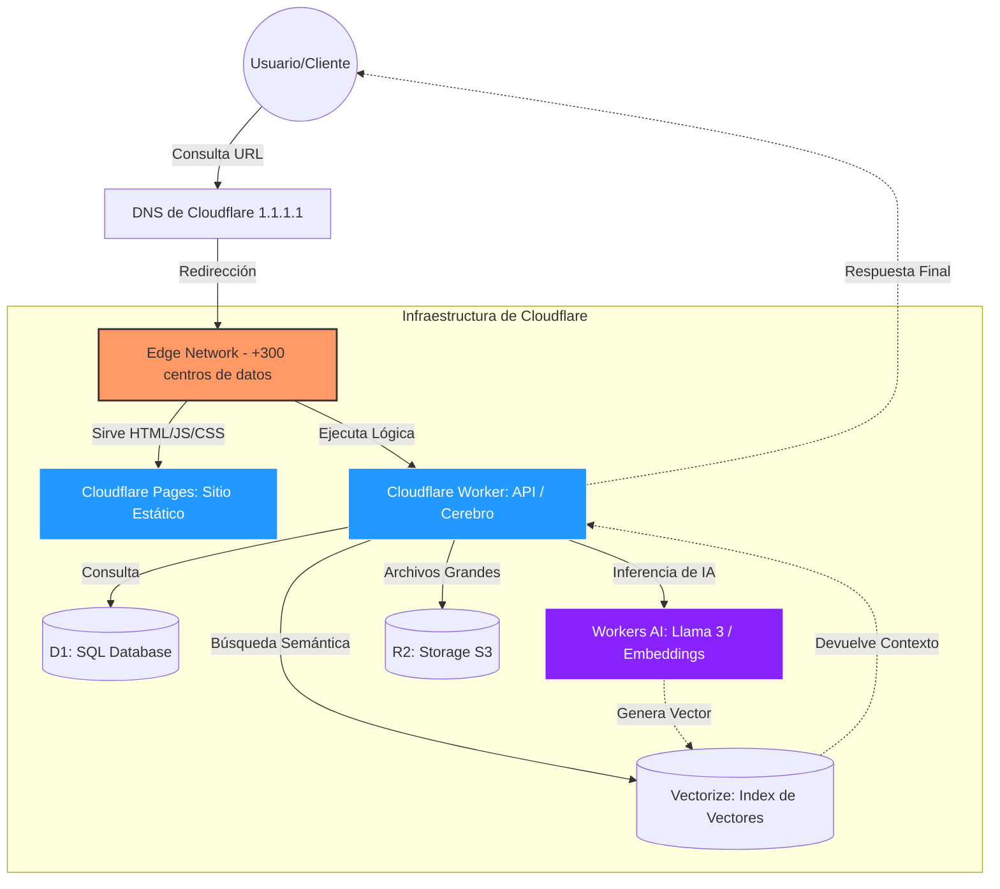

# ☁️ Guía de Arquitectura: Cloudflare Workers & Pages

Cloudflare ha evolucionado de ser un simple CDN a una plataforma de **Edge Computing**. Lo más importante es distinguir entre sus dos motores principales: **Workers** (Lógica/Computación) y **Pages** (Contenido/Hosting).

---

## 1. El Modelo de Ejecución: Workers
A diferencia de las arquitecturas tradicionales basadas en servidores o contenedores (como Docker), los Workers utilizan una tecnología llamada **V8 Isolates**.

*   **Sin Cold Starts:** Al no levantar una máquina virtual completa para cada solicitud, el código se ejecuta casi instantáneamente (latencia < 5ms).
*   **Distribución Global:** Tu código no vive en una "región" (como `us-east-1`), sino que se despliega automáticamente en los más de 300 centros de datos de Cloudflare.
*   **Runtime de JavaScript:** Utiliza el mismo motor que Google Chrome, optimizado para seguridad y velocidad en la red.

---

## 2. Cloudflare Pages: Hosting de Sitios Estáticos
Pages es la solución diseñada para sitios web completos (Frontend).

*   **Jamstack nativo:** Ideal para frameworks como React, Vue, Astro o sitios HTML puros.
*   **Integración con Git:** Al hacer `push` a tu repositorio de GitHub, Cloudflare detecta el cambio, construye el sitio y lo despliega.
*   **Funciones de Pages:** Puedes añadir lógica de backend a tu sitio estático creando una carpeta `/functions`. Esto ejecuta un Worker "invisible" asociado a tu página.

---

## 3. Almacenamiento y Datos (El Ecosistema)
Para que un Worker sea útil, necesita persistencia. Cloudflare ofrece varios productos integrados:

| Producto | Tipo de Dato | Caso de Uso |
| :--- | :--- | :--- |
| **KV (Key-Value)** | Clave-Valor | Configuración, sesiones de usuario, caché persistente. |
| **D1** | SQL Relacional | Bases de datos estructuradas (SQLite).
| **R2** | Objetos (S3 compatible) | Imágenes, videos, archivos PDF de gran tamaño.
| **Vectorize** | Vectores | Almacenamiento para búsqueda semántica en RAG (IA).

---

## 4. El Flujo de una Solicitud (Request)
Cuando un usuario visita tu URL, sucede lo siguiente:

1.  **DNS Resolve:** El navegador pregunta dónde está tu sitio; Cloudflare responde en nanosegundos (es el DNS más rápido del mundo).
2.  **Edge Hit:** La solicitud llega al servidor de Cloudflare más cercano al usuario.
3.  **Worker Execution:** Si hay un Worker configurado, este intercepta la solicitud. Puede modificarla, consultar una base de datos o servir un archivo estático.
4.  **Response:** El Worker devuelve la respuesta directamente al usuario sin haber tocado nunca un "servidor de origen" central.

---

## 5. Herramientas de Desarrollo
El ciclo de vida de un proyecto se gestiona principalmente con **Wrangler**, la interfaz de línea de comandos (CLI).

*   **Desarrollo Local:** `npx wrangler dev` simula el entorno de Cloudflare en tu PC.
*   **Despliegue:** `npx wrangler deploy` (o el script `npm run deploy`) sube el código empaquetado a la nube.
*   **Configuración:** Todo se controla desde el archivo `wrangler.toml`, donde defines el nombre del proyecto, variables de entorno y conexiones a bases de datos.

---

## 6. Resumen de Diferencias Clave

*   **Workers:** Úsalos cuando necesites una API, un webhook, o lógica de procesamiento de datos (como tu sistema de RAG).
*   **Pages:** Úsalo cuando necesites hospedar una interfaz de usuario (el chat, el blog o el dashboard).

> **Nota:** Hoy en día, ambos están tan integrados que puedes tener un sitio en **Pages** que utiliza **Workers** para consultar **Vectorize** e inferencia de IA, todo dentro de la misma infraestructura gratuita.